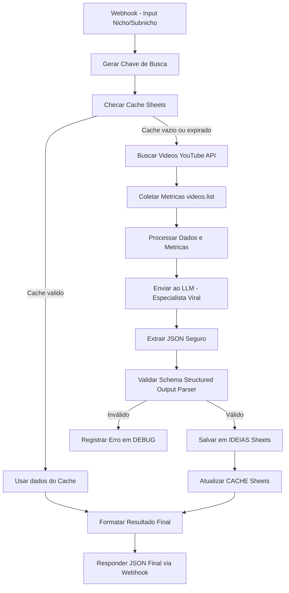

#Sistema de Pesquisa de Tendências para YouTube

## Visão Geral
O objetivo deste projeto é automatizar a **descoberta de oportunidades de conteúdo viral** no YouTube, utilizando **dados reais** obtidos via API e **análise com IA generativa**.  
A automação foi desenvolvida no **n8n**, garantindo um fluxo 100% autônomo: da coleta de dados até a geração de ideias prontas para produção de conteúdo.

---

## Como a Solução Foi Estruturada

A solução foi dividida em **cinco estágios principais**:

1. **Entrada (Input via API/Webhook)**
   - O fluxo inicia com um *Webhook* que recebe como parâmetros:
     ```json
     {
       "nicho": "Saúde 50+",
       "subnicho": "weak legs"
     }
     ```
   - É gerada uma chave de busca (`query = nicho + subnicho`) para padronizar o cache e as pesquisas.

2. **Camada de Cache (Google Sheets)**
   - Antes de realizar buscas na API do YouTube, o sistema verifica se o resultado para a mesma query já existe em cache (aba `CACHE`).
   - Se encontrado e recente (menos de 7 dias), os dados são reutilizados, economizando chamadas à API e processamento do LLM.

3. **Coleta de Dados (YouTube API v3)**
   - Caso não haja cache, o sistema faz requisições diretas à **YouTube Data API v3**:
     - **Pesquisa de vídeos** (`search`) com base no `query`;
     - **Recuperação de métricas** (`videos.list`) para cada ID encontrado.
   - São coletados dados como: título, visualizações, likes, comentários, canal e data de publicação.

4. **Análise e Processamento (Function Nodes + LLM)**
   - Um nó de processamento calcula indicadores simples:
     - **Engajamento relativo**, **média de visualizações**, e **popularidade por canal**.
   - Os dados brutos são enviados a um agente de IA (“Especialista em Conteúdo Viral”), que:
     - Analisa títulos e padrões de sucesso;
     - Identifica **temas recorrentes e emergentes**;
     - Calcula um **Score de Oportunidade (0–100)** com base nos dados;
     - Retorna uma lista de **15 ideias de conteúdo** estruturadas em JSON.

5. **Saída e Armazenamento (Google Sheets + API Response)**
   - O resultado validado é:
     - Gravado na aba `IDEIAS` com todos os campos exigidos;
     - Cacheado para futuras execuções;
     - Retornado via resposta JSON no webhook.

---

##  Documentação de Concepção Técnica

### 🧠 Lógica Central
- **Princípio:** “Dados reais + Análise de IA = Insights acionáveis”.
- **Base de dados:** apenas informações coletadas da API do YouTube.
- **Pipeline:** coleta → análise → geração de insights → persistência.
- **Robustez:** uso de cache e validação de schema JSON garantem estabilidade e economia.

### ⚙️ Componentes principais do fluxo (n8n)
| Etapa | Node | Função |
|-------|------|--------|
| 1 | **Webhook (POST)** | Recebe o input do usuário |
| 2 | **Function** | Gera `query` e `cache_key` |
| 3 | **Google Sheets: Cache Check** | Verifica existência no cache |
| 4 | **IF** | Decide entre usar cache ou coletar novos dados |
| 5 | **YouTube Search (API v3)** | Busca vídeos relevantes |
| 6 | **YouTube Get Video Stats** | Coleta métricas detalhadas |
| 7 | **Process Data (Function)** | Calcula médias e scores preliminares |
| 8 | **LLM: Especialista em Conteúdo Viral (Gemini 1.5)** | Analisa dados e gera ideias |
| 9 | **Function: Extrator JSON Seguro** | Garante que o output seja JSON válido |
|10 | **Structured Output Parser** | Valida schema do JSON final |
|11 | **Google Sheets: IDEIAS** | Salva ideias aprovadas |
|12 | **Google Sheets: CACHE** | Atualiza cache com o resultado |
|13 | **Response Node** | Retorna o resultado final da análise |

---
### Prompt Utilizado
Você é um especialista em estratégia de conteúdo para o YouTube, com foco em identificar tendências virais e gerar ideias de vídeos com alto potencial de engajamento.

## CONTEXTO DA ANÁLISE
- Nicho Principal: {{ $('Criar Chave de Busca').first().json.nicho }}
- Sub-nicho Específico: {{ $('Criar Chave de Busca').first().json.subnicho}}

## DADOS COLETADOS DO YOUTUBE
A seguir estão os vídeos de maior sucesso (ordenados por visualizações) e os canais mais frequentes neste nicho.

### Vídeos Virais:
{{ JSON.stringify($json.viralVideos.slice(0, 15)) }}

### Canais Virais (com contagem de vídeos na lista):
{{ JSON.stringify($json.viralChannels.slice(0, 5)) }}

## SUA TAREFA
Com base EXCLUSIVAMENTE nos dados fornecidos, execute as seguintes ações:
1.  **Identifique Padrões de Sucesso:** Analise os títulos dos vídeos virais. Quais formatos se repetem? (Ex: "Como fazer X", "5 Erros que...", "O Segredo para...", listas numéricas, perguntas diretas).
2.  **Extraia Temas Recorrentes:** Quais são os sub-tópicos ou dores específicas que mais aparecem?
3.  **Gere 15 Novas Ideias de Vídeo:** Para cada ideia, forneça:
    - Um título magnético.
    - Um score de potencial (0-100), baseado no alinhamento com os padrões e temas de sucesso.
    - Uma justificativa curta baseada nos dados.
    - **Um array com 2 a 3 palavras-chave (SEO) relevantes para o título.**
    - **Uma estimativa da concorrência ("baixa", "média", "alta") baseada na quantidade de vídeos similares nos dados fornecidos.**

1) Responda **exatamente** com um objeto JSON contendo a chave principal "ideias" cujo valor é um array (0..15) de objetos.  
2) Cada objeto dentro de "ideias" deve conter EXATAMENTE estas chaves com estes tipos:
   - "titulo": string (título do vídeo)
   - "score": integer entre 0 e 100
   - "justificativa": string curta
   - "palavras_chave": array com 2 a 3 strings
   - "concorrencia": string com valor exato "baixa", "média" ou "alta"
3) Se houver menos de 15 ideias válidas com base nos dados, gere só as ideias válidas (array pode ter menos de 15). Não gere campos extras, nem valores nulos.  
4) Se por alguma razão você não puder gerar ideias, retorne: {"ideias": []}
5) NÃO inclua nenhuma outra saída além do objeto JSON. Qualquer texto adicional fará a validação falhar.
6) Mantenha temperatura baixa (determinístico); o sistema que dispara este prompt cuidará do resto.

## FORMATO DE SAÍDA OBRIGATÓRIO
Utilize o Structured Output Parser para estrutrar o OUTPUT Sua resposta DEVE ser um único e válido objeto JSON, sem nenhum texto, comentários ou formatação markdown antes ou depois. Use EXATAMENTE a estrutura do exemplo:

### Diagrama Mermaid (Fluxo n8n)


